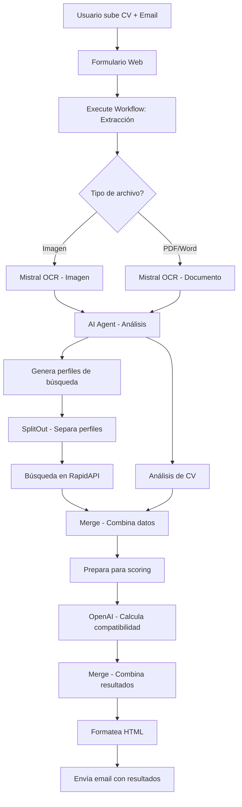

# 🎯 Trabajo Final - Sistema de Análisis de CV y Búsqueda de Ofertas Laborales

## 📋 Descripción del Proyecto

Este proyecto implementa un sistema automatizado en n8n que analiza CVs de candidatos y busca ofertas laborales relevantes utilizando inteligencia artificial. El sistema procesa CVs en formato PDF o imagen, extrae información clave, genera perfiles de búsqueda personalizados y encuentra ofertas de trabajo compatibles con el perfil del candidato.

## 🎯 Objetivo

Desarrollar un workflow funcional que:
- Procese CVs automáticamente (PDF e imágenes)
- Analice el contenido usando IA para extraer fortalezas, habilidades y áreas de mejora
- Genere perfiles de búsqueda personalizados
- Busque ofertas laborales relevantes en tiempo real
- Calcule un score de compatibilidad entre el CV y cada oferta
- Envíe un reporte detallado por email al candidato

## 🏗️ Arquitectura del Sistema

El proyecto está compuesto por tres workflows principales:

### 1. **TF_Main** - Workflow Principal
- **Trigger**: Formulario web para subir CV y email
- **Funcionalidad**: Orquesta todo el proceso de análisis y búsqueda
- **Nodos**: 12 nodos activos
- **Monitoreo**: Integrado con sistema de manejo de errores

### 2. **TF_SW_Extraccion_Texto** - Subworkflow
- **Trigger**: Ejecutado por el workflow principal
- **Funcionalidad**: Extrae texto de CVs (PDF e imágenes)
- **Nodos**: 3 nodos activos

### 3. **TF_Monitoreo_Error** - Workflow de Monitoreo
- **Trigger**: Error Trigger (se activa automáticamente en caso de errores)
- **Funcionalidad**: Registra errores y envía notificaciones
- **Nodos**: 3 nodos activos
- **Características**:
  - Registra errores en Google Sheets
  - Envía alertas por email al administrador
  - Proporciona información detallada del error y contexto

## 🔄 Flujo del Proceso



## 🛠️ Tecnologías Utilizadas

### Servicios Externos
- **Mistral OCR**: Extracción de texto y comprensión de documentos
- **OpenAI GPT-3.5/GPT-4**: Análisis de CV y cálculo de compatibilidad
- **RapidAPI JSearch**: Búsqueda de ofertas laborales
- **Gmail**: Envío de reportes por email

### Nodos n8n
- **Formulario Web**: Captura de datos del usuario
- **Execute Workflow**: Llamada al subworkflow
- **Switch**: Manejo de diferentes tipos de archivo
- **AI Agent**: Análisis inteligente de CVs
- **HTTP Request**: Integración con APIs externas
- **Function Nodes**: Transformación y procesamiento de datos
- **Merge/SplitOut**: Combinación y separación de datos
- **Gmail**: Envío de emails
- **Error Trigger**: Monitoreo automático de errores
- **Google Sheets**: Registro de errores y métricas

## 📦 Instalación y Configuración

### Prerrequisitos
- Instancia de n8n funcionando
- Cuentas en los servicios externos:
  - Mistral AI (para Mistral OCR API)
  - OpenAI
  - RapidAPI (JSearch)
  - Gmail (OAuth2)
  - Google Sheets (OAuth2)

### Pasos de Instalación

1. **Importar Workflows**
   ```bash
   # En n8n, importar los siguientes archivos:
   - src/TF_Main.json
   - src/TF_SW_Extraccion_Texto.json
   - src/TF_Monitoreo_Error.json
   ```

2. **Configurar Credenciales**
   
   **Mistral OCR:**
   - Tipo: `Mistral Cloud API`
   - Nombre: `Mistral Cloud account`
   - API Key: Tu clave de Mistral AI
   - Endpoint: `mistral-ocr-latest` (procesamiento de documentos)

   **OpenAI:**
   - Tipo: `OpenAI API`
   - Nombre: `OpenAi account`
   - API Key: Tu clave de OpenAI

   **RapidAPI:**
   - Tipo: `HTTP Header Auth`
   - Nombre: `Header RapidAPI- JSearch`
   - Header Name: `X-RapidAPI-Key`
   - Header Value: Tu clave de RapidAPI

   **Gmail:**
   - Tipo: `Gmail OAuth2`
   - Nombre: `Gmail account`
   - Configurar OAuth2 con tu cuenta de Gmail

   **Google Sheets:**
   - Tipo: `Google Sheets OAuth2`
   - Nombre: `Google Sheets account`
   - Configurar OAuth2 con tu cuenta de Google
   - Crear una hoja de cálculo para el registro de errores

3. **Activar Workflows**
   - Activar el workflow principal `TF_Main`
   - Activar el workflow de monitoreo `TF_Monitoreo_Error`
   - El subworkflow `TF_SW_Extraccion_Texto` se activa automáticamente

## 🚀 Uso del Sistema

### Para Usuarios Finales

1. **Acceder al Formulario**
   - Visita la URL del formulario web generada por n8n
   - https://n8n.srv899304.hstgr.cloud/form/53efeac5-cf4d-43fe-9fe3-a9e3ed205e2c

2. **Subir CV**
   - Completa el campo de email
   - Sube tu CV en formato PDF, Word (.doc, .docx), BMP, JPG o PNG
   - Haz clic en "Enviar"

3. **Recibir Resultados**
   - El sistema procesará tu CV automáticamente
   - Recibirás un email con:
     - Análisis detallado de tu CV
     - Ofertas laborales relevantes
     - Score de compatibilidad para cada oferta
     - Enlaces para postularse

### Para Desarrolladores

**Ejecutar Workflow Manualmente:**
```json
{
  "Email": "usuario@ejemplo.com",
  "CV": [archivo_binario]
}
```

## 📊 Estructura de Datos

### Entrada del Formulario
```json
{
  "Email": "string",
  "CV": "binary_file"
}
```

### Salida del AI Agent
```json
{
  "profiles": [
    {
      "Query": "string",
      "Country": "string", 
      "Language": "string",
      "Job_requirements": "string",
      "Location": "string"
    }
  ],
  "cv_feedback": {
    "strengths": ["string"],
    "improvements": ["string"],
    "suggested_rewrite": "string",
    "skills": ["string"]
  }
}
```

### Resultado del Scoring
```json
{
  "job_id": "string",
  "match_score": "number (0-100)",
  "matched_skills": ["string"],
  "note": "string"
}
```

## 📊 Sistema de Monitoreo de Errores

El proyecto incluye un sistema de monitoreo que registra y notifica automáticamente cualquier error que ocurra durante la ejecución:

### Características del Monitoreo
- **Registro Automático**: Todos los errores se registran en Google Sheets con:
  - Fecha y hora del error
  - Nombre del workflow que falló
  - URL de la ejecución
  - Nodo específico donde ocurrió el error
  - Mensaje detallado del error

- **Notificaciones Inmediatas**: Se envía un email al administrador con:
  - Información del error
  - Stack trace completo
  - Enlace directo a la ejecución en n8n

- **Activación Automática**: El sistema se activa automáticamente cuando hay errores, sin intervención manual

### Configuración del Monitoreo
1. **Crear Hoja de Google Sheets** para el registro de errores
2. **Configurar credenciales** de Google Sheets OAuth2
3. **Activar el workflow** `TF_Monitoreo_Error`
4. **Verificar notificaciones** en el email configurado

## 🔧 Configuración Avanzada

### Personalizar Búsquedas
Edita el nodo "AI Agent" para modificar:
- Número de perfiles generados
- Criterios de búsqueda
- Idiomas soportados
- Países objetivo

### Ajustar Scoring
Modifica el nodo "Calcula score" para:
- Cambiar criterios de compatibilidad
- Ajustar pesos de diferentes factores
- Personalizar el rango de scores

### Personalizar Email
Edita el nodo "Formatea resultados en HTML" para:
- Cambiar el diseño del email
- Modificar secciones mostradas
- Ajustar estilos CSS

## ⚠️ Limitaciones Conocidas

### Problemas Actuales

**1. Sistema de Scoring de Compatibilidad**
- El porcentaje de matcheo entre CV y ofertas requiere ajustes y calibración
- La justificación del score no siempre refleja con precisión los criterios de compatibilidad
- Se recomienda tomar el score como orientativo y revisar manualmente las ofertas
- **Estado**: En proceso de mejora para próximas versiones

**2. Cobertura Geográfica Limitada**
- La API actual (JSearch) solo contempla ofertas del sector privado
- Para Uruguay, no incluye ofertas del Portal del Estado

**3. Formatos de CV Soportados**
- El sistema acepta archivos en formato PDF, Word (.doc, .docx), BMP, JPG y PNG
- Utiliza Mistral OCR API, para extracción de texto y comprensión de documentos
- La restricción de formatos es intencional para mantener compatibilidad con los formatos más comunes

## 🐛 Solución de Problemas

### Errores Comunes

**1. Error de credenciales**
- Verificar que todas las credenciales estén configuradas correctamente
- Comprobar que las API keys sean válidas y tengan permisos

**2. Error en extracción de texto**
- Comprobar que el archivo no esté corrupto

**3. Error en búsqueda de ofertas**
- Comprobar límites de la API de RapidAPI

**4. Error en envío de email**
- Verificar configuración OAuth2 de Gmail
- Comprobar permisos de la cuenta de Gmail

### Logs y Debugging
- Revisar logs de ejecución en n8n
- Usar el modo debug para inspeccionar datos entre nodos
- Verificar conectividad de APIs externas
- **Monitoreo Automático**: Consultar la hoja de Google Sheets para ver historial de errores
- **Notificaciones**: Revisar emails automáticos con detalles de errores

## ❓ Preguntas Frecuentes (FAQ)

### General

**¿Cuánto tiempo tarda en procesarse un CV?**
El tiempo de procesamiento varía según el tipo y tamaño del archivo, pero generalmente toma entre 30 segundos y 2 minutos desde que se sube hasta recibir el email con resultados.

**¿Qué formato de CV debo usar?**
Soportamos PDF, Word (.doc, .docx), BMP, JPG y PNG. El sistema utiliza Mistral OCR, una API de última generación en comprensión de documentos que procesa textos, tablas, imágenes y ecuaciones con alta precisión. Todos los formatos mencionados son procesados con excelente calidad.

**¿Cuántas ofertas laborales recibiré?**
El sistema genera múltiples perfiles de búsqueda basados en tu CV y busca ofertas para cada uno. Típicamente recibirás entre 5 y 15 ofertas relevantes, dependiendo de la disponibilidad en el mercado.

**¿El servicio tiene algún costo?**
Este proyecto es educativo y gratuito. Sin embargo, utiliza APIs de pago (OpenAI, Mistral, RapidAPI) que tienen límites de uso.

### Sobre los Resultados

**¿Qué significa el score de compatibilidad?**
Es un porcentaje (0-100%) que indica qué tan bien coincide tu perfil con los requisitos de la oferta. **Nota**: Actualmente este score está en proceso de calibración, por lo que se recomienda revisar manualmente las ofertas.

**¿Por qué no recibí ofertas de mi área?**
Puede deberse a: (1) Falta de ofertas disponibles en ese momento, (2) La API de búsqueda tiene cobertura limitada en ciertas regiones, (3) El análisis del CV no identificó correctamente tu área de especialización.

**¿Las ofertas son siempre actuales?**
Las ofertas provienen de JSearch API que agrega datos de múltiples portales. La mayoría son recientes, pero algunas pueden tener varios días de antigüedad.

**¿Por qué no aparecen ofertas del sector público uruguayo?**
La API actual solo indexa ofertas del sector privado. Las ofertas del Portal del Estado de Uruguay están planificadas para versiones futuras.

### Privacidad y Seguridad

**¿Qué se hace con mi CV?**
Tu CV se procesa únicamente para extraer información relevante y generar el análisis. Actualmente no se almacena después del procesamiento, aunque esto podría cambiar en futuras versiones con tu consentimiento.

**¿Mi email es compartido con terceros?**
No. Tu email solo se usa para enviarte los resultados del análisis. No se comparte con empleadores ni terceros.

**¿Puedo eliminar mis datos?**
Sí. Dado que actualmente no almacenamos datos persistentes, no hay información que eliminar después de recibir tu email de resultados.

### Soporte Técnico

**No recibí el email con los resultados, ¿qué hago?**
1. Revisa tu carpeta de spam o correo no deseado
2. Verifica que ingresaste correctamente tu email
3. Contacta al administrador si el problema persiste (el sistema de monitoreo registrará el error)

**¿Puedo volver a procesar mi CV actualizado?**
Sí, puedes usar el formulario tantas veces como desees con tu CV actualizado.

**¿El sistema funciona para cualquier país?**
El análisis de CV funciona para cualquier país, pero la búsqueda de ofertas depende de la cobertura de JSearch API, que es más amplia en países angloparlantes y algunas regiones de Latinoamérica.

## 🚀 Mejoras Futuras y Roadmap

### Funcionalidades Planeadas

**1. Sistema de Matcheo Configurable**
- Permitir al usuario ajustar el porcentaje mínimo de compatibilidad deseado

**2. Alertas Periódicas Automatizadas**
- Envío automático de ofertas nuevas una vez por semana
- Sistema de marcado de avisos nuevos vs. ya enviados
- Base de datos de ofertas enviadas para evitar duplicados
- Notificaciones solo cuando hay ofertas nuevas relevantes

**3. Persistencia de Datos**
- Almacenar CVs procesados y perfiles de búsqueda
- Histórico de ofertas enviadas por candidato
- Base de datos de seguimiento de aplicaciones

**4. Dashboard de Métricas**
- Estadísticas de uso del sistema
- Análisis de tasa de matcheo por industria/rol
- Seguimiento de ofertas más populares
- Métricas de efectividad del sistema

**5. Mejoras en el Análisis de CV**
- Extracción automática de información de contacto y redes sociales
- Identificación automática de años de experiencia por rol
- Detección avanzada de certificaciones y educación formal
- Reconocimiento de habilidades técnicas específicas por industria

**6. Experiencia de Usuario Mejorada**
- Portal web para que usuarios gestionen sus preferencias
- Opción de pausar/reanudar búsquedas automáticas
- Calificación de ofertas recibidas (feedback loop)
- Historial de ofertas recibidas y aplicadas

**7. Integraciones Adicionales**
- Conexión directa con LinkedIn para obtener más datos del perfil
- Integración con más portales de empleo (LinkedIn Jobs, Indeed, etc.)
- **Portal del Estado (Uruguay)**: Búsqueda de ofertas laborales del sector público uruguayo

**8. Seguridad y Privacidad**
- Encriptación de CVs almacenados
- Sistema de consentimiento GDPR
- Opción de eliminar datos personales
- Auditoría de acceso a información sensible

### Próximos Pasos

1. Implementar sistema de base de datos para almacenar ofertas históricas
2. Crear workflow de alertas semanales con detección de duplicados
3. Agregar configuración de umbrales de matcheo personalizables
4. Desarrollar dashboard básico de métricas

## 👥 Contribuciones

Este proyecto fue desarrollado como trabajo final del curso de Automatismos con IA.

### Licencia
Este proyecto es para fines educativos.


