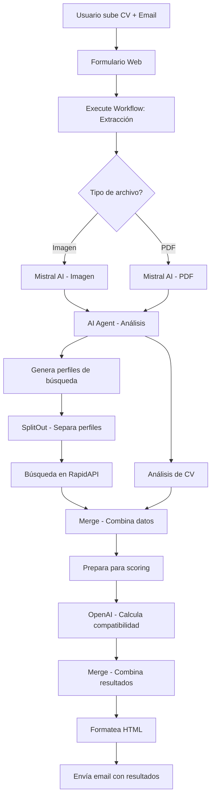

# 🎯 Trabajo Final - Sistema de Análisis de CV y Búsqueda de Ofertas Laborales

## 📋 Descripción del Proyecto

Este proyecto implementa un sistema automatizado en n8n que analiza CVs de candidatos y busca ofertas laborales relevantes utilizando inteligencia artificial. El sistema procesa CVs en formato PDF o imagen, extrae información clave, genera perfiles de búsqueda personalizados y encuentra ofertas de trabajo compatibles con el perfil del candidato.

## 🎯 Objetivo

Desarrollar un workflow funcional que:
- Procese CVs automáticamente (PDF e imágenes)
- Analice el contenido usando IA para extraer fortalezas, habilidades y áreas de mejora
- Genere perfiles de búsqueda personalizados
- Busque ofertas laborales relevantes en tiempo real
- Calcule un score de compatibilidad entre el CV y cada oferta
- Envíe un reporte detallado por email al candidato

## 🏗️ Arquitectura del Sistema

El proyecto está compuesto por dos workflows principales:

### 1. **TF_Main** - Workflow Principal
- **Trigger**: Formulario web para subir CV y email
- **Funcionalidad**: Orquesta todo el proceso de análisis y búsqueda
- **Nodos**: 12 nodos activos

### 2. **TF_SW_Extraccion_Texto** - Subworkflow
- **Trigger**: Ejecutado por el workflow principal
- **Funcionalidad**: Extrae texto de CVs (PDF e imágenes)
- **Nodos**: 3 nodos activos

## 🔄 Flujo del Proceso



## 🛠️ Tecnologías Utilizadas

### Servicios Externos
- **Mistral AI**: Extracción de texto de imágenes y PDFs
- **OpenAI GPT-3.5/GPT-4**: Análisis de CV y cálculo de compatibilidad
- **RapidAPI JSearch**: Búsqueda de ofertas laborales
- **Gmail**: Envío de reportes por email

### Nodos n8n
- **Formulario Web**: Captura de datos del usuario
- **Execute Workflow**: Llamada al subworkflow
- **Switch**: Manejo de diferentes tipos de archivo
- **AI Agent**: Análisis inteligente de CVs
- **HTTP Request**: Integración con APIs externas
- **Function Nodes**: Transformación y procesamiento de datos
- **Merge/SplitOut**: Combinación y separación de datos
- **Gmail**: Envío de emails

## 📦 Instalación y Configuración

### Prerrequisitos
- Instancia de n8n funcionando
- Cuentas en los servicios externos:
  - Mistral AI
  - OpenAI
  - RapidAPI (JSearch)
  - Gmail (OAuth2)

### Pasos de Instalación

1. **Importar Workflows**
   ```bash
   # En n8n, importar los siguientes archivos:
   - src/TF_Main.json
   - src/TF_SW_Extraccion_Texto.json
   ```

2. **Configurar Credenciales**
   
   **Mistral AI:**
   - Tipo: `Mistral Cloud API`
   - Nombre: `Mistral Cloud account`
   - API Key: Tu clave de Mistral AI

   **OpenAI:**
   - Tipo: `OpenAI API`
   - Nombre: `OpenAi account`
   - API Key: Tu clave de OpenAI

   **RapidAPI:**
   - Tipo: `HTTP Header Auth`
   - Nombre: `Header RapidAPI- JSearch`
   - Header Name: `X-RapidAPI-Key`
   - Header Value: Tu clave de RapidAPI

   **Gmail:**
   - Tipo: `Gmail OAuth2`
   - Nombre: `Gmail account`
   - Configurar OAuth2 con tu cuenta de Gmail

3. **Activar Workflows**
   - Activar el workflow principal `TF_Main`
   - El subworkflow `TF_SW_Extraccion_Texto` se activa automáticamente

## 🚀 Uso del Sistema

### Para Usuarios Finales

1. **Acceder al Formulario**
   - Visita la URL del formulario web generada por n8n
   - Ejemplo: `https://tu-instancia-n8n.com/form/53efeac5-cf4d-43fe-9fe3-a9e3ed205e2c`

2. **Subir CV**
   - Completa el campo de email
   - Sube tu CV en formato PDF, PNG o JPG
   - Haz clic en "Enviar"

3. **Recibir Resultados**
   - El sistema procesará tu CV automáticamente
   - Recibirás un email con:
     - Análisis detallado de tu CV
     - Ofertas laborales relevantes
     - Score de compatibilidad para cada oferta
     - Enlaces para postularse

### Para Desarrolladores

**Ejecutar Workflow Manualmente:**
```json
{
  "Email": "usuario@ejemplo.com",
  "CV": [archivo_binario]
}
```

## 📊 Estructura de Datos

### Entrada del Formulario
```json
{
  "Email": "string",
  "CV": "binary_file"
}
```

### Salida del AI Agent
```json
{
  "profiles": [
    {
      "Query": "string",
      "Country": "string", 
      "Language": "string",
      "Job_requirements": "string",
      "Location": "string"
    }
  ],
  "cv_feedback": {
    "strengths": ["string"],
    "improvements": ["string"],
    "suggested_rewrite": "string",
    "skills": ["string"]
  }
}
```

### Resultado del Scoring
```json
{
  "job_id": "string",
  "match_score": "number (0-100)",
  "matched_skills": ["string"],
  "note": "string"
}
```

## 🔧 Configuración Avanzada

### Personalizar Búsquedas
Edita el nodo "AI Agent" para modificar:
- Número de perfiles generados
- Criterios de búsqueda
- Idiomas soportados
- Países objetivo

### Ajustar Scoring
Modifica el nodo "Calcula score" para:
- Cambiar criterios de compatibilidad
- Ajustar pesos de diferentes factores
- Personalizar el rango de scores

### Personalizar Email
Edita el nodo "Formatea resultados en HTML" para:
- Cambiar el diseño del email
- Modificar secciones mostradas
- Ajustar estilos CSS

## 🐛 Solución de Problemas

### Errores Comunes

**1. Error de credenciales**
- Verificar que todas las credenciales estén configuradas correctamente
- Comprobar que las API keys sean válidas y tengan permisos

**2. Error en extracción de texto**
- Verificar que el archivo sea PDF, PNG o JPG válido
- Comprobar que el archivo no esté corrupto

**3. Error en búsqueda de ofertas**
- Verificar conexión a internet
- Comprobar límites de la API de RapidAPI

**4. Error en envío de email**
- Verificar configuración OAuth2 de Gmail
- Comprobar permisos de la cuenta de Gmail

### Logs y Debugging
- Revisar logs de ejecución en n8n
- Usar el modo debug para inspeccionar datos entre nodos
- Verificar conectividad de APIs externas

## 📈 Mejoras Futuras

### Funcionalidades Adicionales
- [ ] Soporte para más formatos de CV (DOC, DOCX)
- [ ] Integración con LinkedIn
- [ ] Dashboard de estadísticas
- [ ] Notificaciones push
- [ ] Múltiples idiomas en la interfaz

### Optimizaciones
- [ ] Cache de resultados de búsqueda
- [ ] Procesamiento en lotes
- [ ] Rate limiting inteligente
- [ ] Compresión de imágenes

## 👥 Contribuciones

Este proyecto fue desarrollado como trabajo final del curso de Automatismos con IA.

### Autores
- [Tu nombre aquí]
- [Nombres del equipo]

### Licencia
Este proyecto es para fines educativos.

## 📞 Soporte

Para soporte técnico o preguntas sobre el proyecto:
- Revisar la documentación
- Consultar logs de n8n
- Contactar al equipo de desarrollo

---

**Versión**: 1.0  
**Última actualización**: [Fecha actual]  
**Estado**: ✅ Funcional y listo para producción
