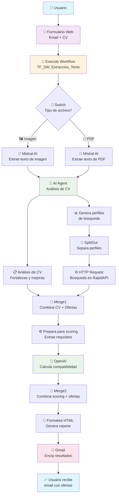
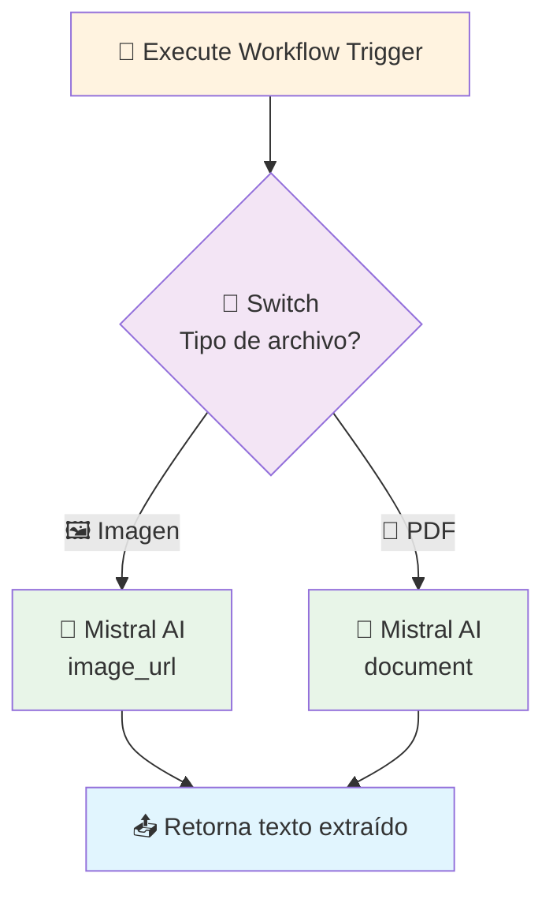
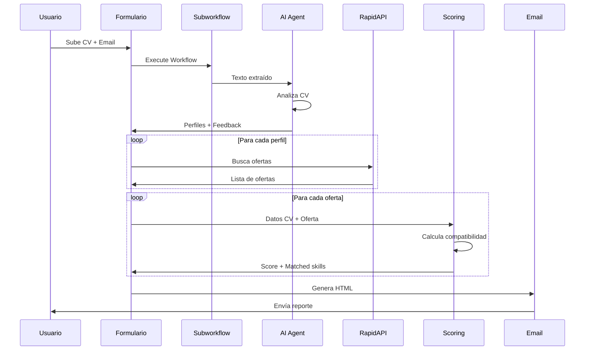
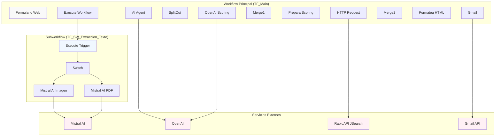
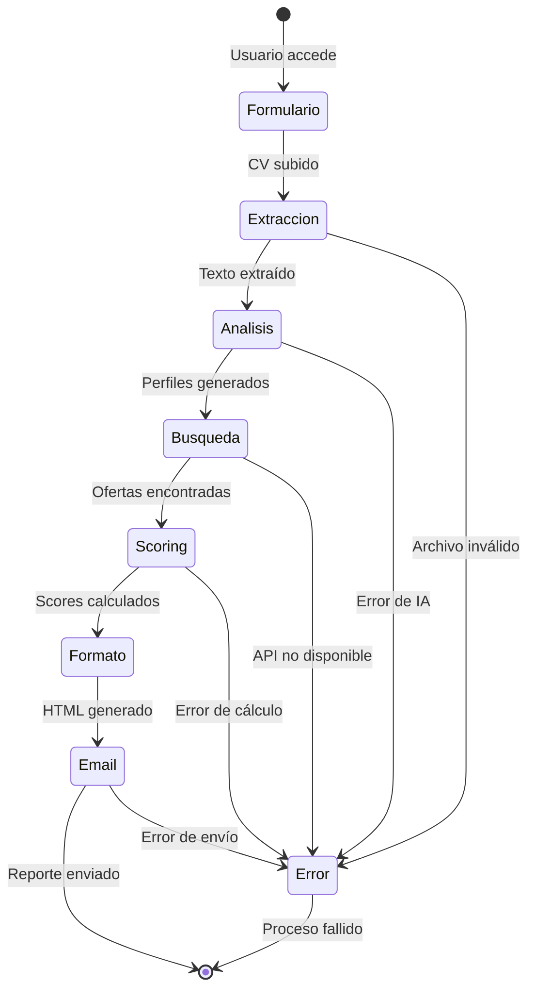
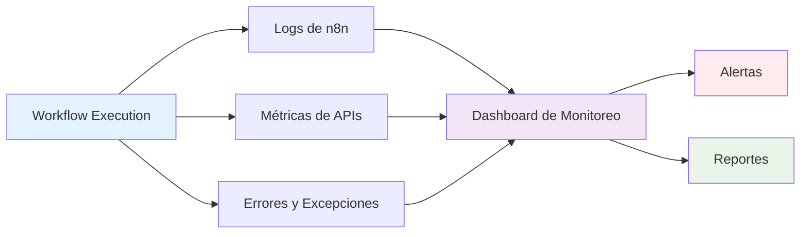

# 📊 Diagrama del Flujo del Workflow

## Diagrama Principal

## Subworkflow: Extracción de Texto

## Flujo de Datos Detallado

## Arquitectura de Componentes

## Estados del Proceso

## Métricas y Monitoreo

